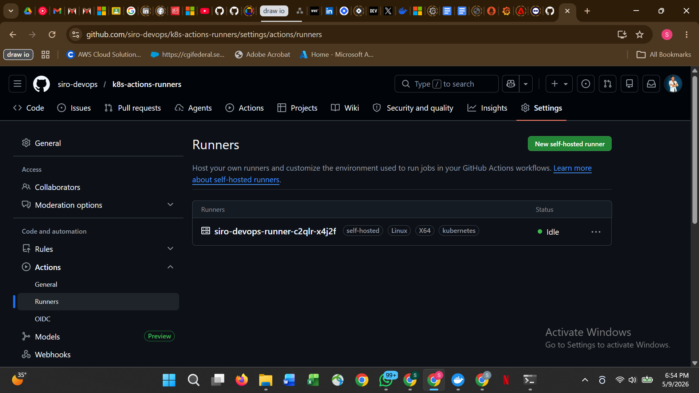
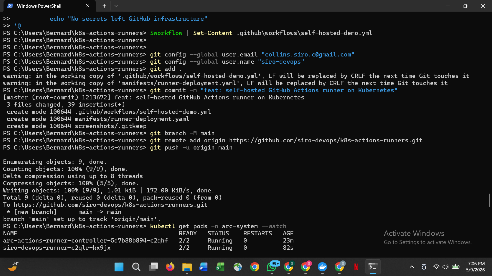
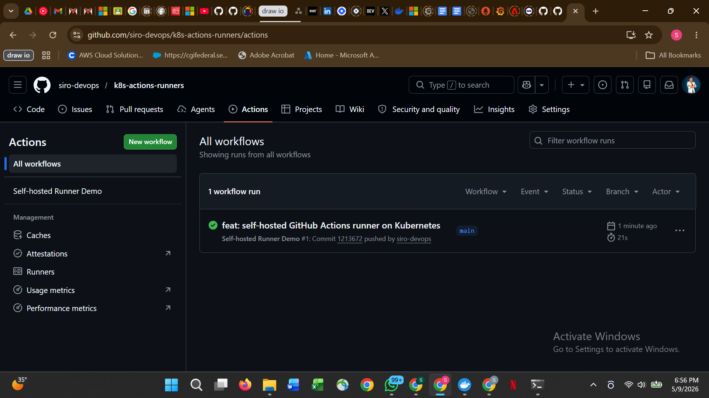

# Self-hosted GitHub Actions Runners on Kubernetes

CI/CD pipeline running inside a Kubernetes cluster using Actions Runner Controller.
No jobs on GitHub shared runners. No secrets leaving your infrastructure.
Full control over the runtime environment.

## How it works

1. Actions Runner Controller runs in the cluster and watches GitHub for queued jobs
2. When a job is queued with runs-on: [self-hosted, kubernetes] ARC spins up a runner pod
3. The runner pod executes the job inside the cluster
4. When the job completes the pod is cleaned up automatically

## What was proved

| Test | Result |
|---|---|
| ARC installed on Kubernetes | Controller running 2/2 |
| Runner registered with GitHub | Shown as Idle in repo settings |
| Workflow triggered on push | Runner picked up job and executed inside cluster |
| Job passed | All steps completed successfully |

## Evidence

### Runner registered as Idle in GitHub

### Workflow passing on self-hosted runner

### Runner pod running job in Kubernetes

## Project structure

manifests/runner-deployment.yaml         -- RunnerDeployment CRD
.github/workflows/self-hosted-demo.yml   -- Workflow using self-hosted runner

## Key concepts demonstrated

Actions Runner Controller -- Kubernetes operator that manages runner lifecycle.
Runners are created on demand and destroyed after each job.

Self-hosted runners -- jobs run inside your own infrastructure. Useful for
accessing internal services, using custom tools, or keeping secrets on-premise.

Runner labels -- runs-on: [self-hosted, kubernetes] routes jobs to the right
runner pool. Multiple pools can serve different teams or environments.

Ephemeral runners -- each job gets a fresh runner pod. No state leaks between
jobs. Cleaner and more secure than persistent runners.

## Stack

Actions Runner Controller, Kubernetes, GitHub Actions, cert-manager, Docker Desktop

## What I would add next

- Runner autoscaling with HorizontalRunnerAutoscaler
- Separate runner pools per environment (dev, staging, prod)
- Custom runner image with pre-installed tools (kubectl, terraform, helm)
- Runner groups to restrict which repos can use which runners
- Dind-rootless mode for improved security
